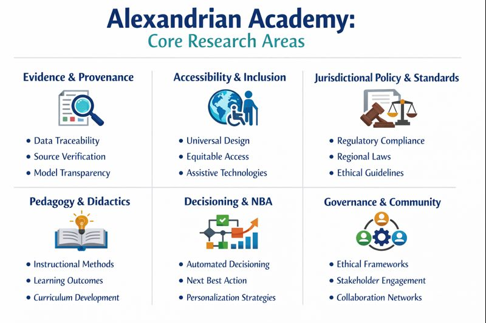
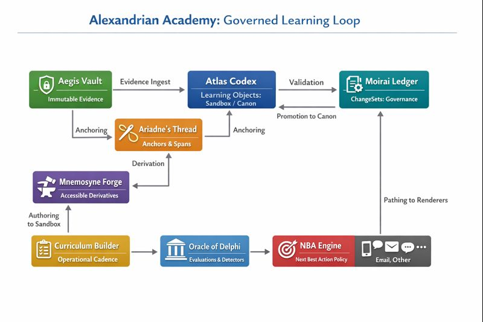

# Agentic Learning & Teaching Architecture (Repository Canon)

We implement learning as a governed loop with provenance, policy constraints, and omnichannel action rendering. The diagrams in this repo are original, generated from internal specs, and contain only our semantic labels. This matters because diagrams that embed sensitive third-party artifacts create disclosure risk and constrain open collaboration.

## Diagrams (repository-original)

1) Platform Architecture (Governed Learning Loop)  

2) Core Research Areas  

If diagrams are missing, generate them from:
- docs/diagrams/specs/
- docs/diagrams/prompts/dalle-prompts.md

## System thesis

- Evidence enters immutably (Aegis Vault).
- Meaning is anchored precisely (Ariadne’s Thread).
- Accessible derivatives are generated reproducibly (Mnemosyne Forge).
- Curriculum objects live as versioned learning objects with Sandbox/Canon separation (Atlas Codex).
- Governance is append-only and reversible (Moirai Ledger).
- Evaluation is reproducible and policy-snapshotted (Oracle of Delphi).

## Omnichannel rendering

The NBA engine emits a channel-agnostic action contract; renderers adapt it to phone/chat/messaging/email/other.
See: ./channels/omnichannel-rendering.md and ./nba/next-best-action.md

## Canon vs Sandbox boundary

Promotion from Sandbox → Canon occurs only via a Moirai ChangeSet and must pass Delphi evaluations.
See: ./validation/canon-gates.md and ../../moirai-ledger/README.md

## Interoperability appendices
- LOM mapping: ../interoperability/lom-mapping.md
- edX/OLX mapping: ../interoperability/edx-structure-mapping.md
- OCW/Coursera parallels: ../interoperability/ocw-coursera-parallels.md
